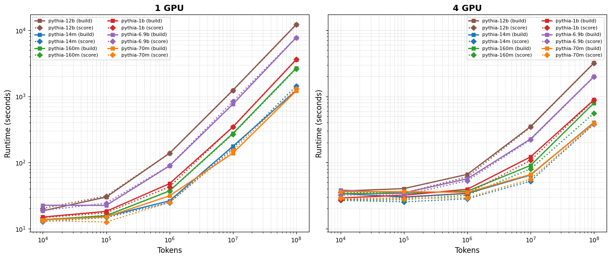

# Bergson
Bergson is a python library which provides scalable, state-of-the-art data attribution methods for large language models, including  [EK-FAC](https://arxiv.org/abs/2308.03296) (2023), [TrackStar](https://arxiv.org/abs/2410.17413v3) (2024), and [Magic](https://arxiv.org/abs/2504.16430) (2025), alongside simple baselines such as gradient cosine similarity.

Data attribution methods estimate the effect on a behavior of interest of removing data points from a model's training corpus. Exactly computing these effects for a corpus of N items requires 2**N retraining runs. Our most costly and powerful method, MAGIC, uses compute equivalent to 3-5 training runs to produce per-token or per-sequence scores that correlate with the effects of leave-k-out retraining at ρ>0.9 in well-behaved settings. Faster methods like EK-FAC and TrackStar use compute equivalent to ~1 training run (with more modest VRAM usage), but correlate less with leave-k-out retraining (ρ\~=0.3 with careful hyperparameter tuning).

## Core features

Per-token and per-sequence attribution is available everywhere. On-disk gradient stores and on-the-fly queries are supported. Almost every feature is available through both the CLI and a programmatic interface, which use a shared set of configuration dataclasses. Configuration dataclasses are always serialized to disk so commands can be reproduced in one line. To understand every available configuration option, [check out the documentation](https://bergson.readthedocs.io/en/latest/api.html#bergson.IndexConfig).

Bergson uses FSDP2 or SimpleFSDP, BitsAndBytes, and low-level performance optimizations to support large models, datasets, and clusters. Bergson integrates with HuggingFace Transformers and Datasets, and also supports on-disk datasets in a variety of formats.

### Attribute through Training

Bergson provides a functional MAGIC Trainer with distributed support that enables near-optimal data attribution, by backpropagating through the training process to
compute the gradient of a loss with respect to an implicit weighting placed on each training item. See `bergson magic`.

Building a train‑time raw gradient store is also available through a HF Trainer callback, at a ~17% performance overhead.

### Attribute Post-Hoc

Bergson provides a gradient store for efficient serial queries. Collection-time gradient compression makes the store space-efficient, and a FAISS integration enables fast KNN search over large stores. See `bergson build` and `bergson query` (`Attributor` in the programmatic interface).

For small queries and methods that don't use gradient compression (e.g., EK-FAC), score a dataset in a single pass using an in-memory query index of precomputed gradients. Dataset items may be scored using max, mean, and individual scoring strategies, enabling [LESS](https://arxiv.org/pdf/2402.04333)-style data filtering. See `bergson score`, `bergson build`, and `bergson reduce`.

Per-module and per-attention head gradient storage enables mechanistic interpretability.

At a higher level, `bergson trackstar`, `bergson ekfac`, and `bergson approx_unrolling` orchestrate several multi-step attribution methods.

**Note: influence functions are highly sensitive to Hessian approximation inversion hyperparameters. Untuned hyperparameters can result in a linear datamodeling score of zero.**

# Announcements

**January - April 2026**
- Support MAGIC
- Support per-token attribution
- Support EK-FAC
- [Experimental] Support distributing hessians across nodes and devices for VRAM-efficient computation through the GradientCollectorWithDistributedHessians. If you would like this functionality exposed via the CLI please get in touch! https://github.com/EleutherAI/bergson/pull/100

## Notebooks

| | Notebook | Description |
|---|----------|-------------|
| [](https://colab.research.google.com/github/EleutherAI/bergson/blob/colab-notebooks-v2/notebooks/poison_detection.ipynb) | **Poison Detection** | Detect poisoned training examples with gradient attribution (T4, ~5 min) |
| [](https://colab.research.google.com/github/EleutherAI/bergson/blob/colab-notebooks-v2/notebooks/style_ablation.ipynb) | **Style Ablation** | Suppress style to recover semantic matching (A100, ~20 min) |

# Installation

```bash
pip install bergson
```

# Quickstart

Use MAGIC to attribute a GPT-2 WikiText fine-tune:

```bash
bergson examples/magic/gpt2_wikitext_tiny.yaml
```

Construct and query an on-disk index of randomly projected gradients:

```bash
bergson build runs/index --model EleutherAI/pythia-14m --dataset NeelNanda/pile-10k --truncation --token_batch_size 4096 --projection_dim 16
bergson query --index runs/index --unit_norm
```

Collect TrackStar attribution scores for an I.I.D sample query:

```bash
bergson trackstar runs/trackstar --model EleutherAI/pythia-14m --query.dataset NeelNanda/pile-10k --data.dataset NeelNanda/pile-10k --data.truncation --token_batch_size 4096 --query.truncation --query.split "train[:20]"
```

# Documentation

Full documentation is available at https://bergson.readthedocs.io/.

## Run with YAMLs

Every run writes a self-describing `config.yaml` into its output directory, enabling the command(s) to be reproduced:

```bash
bergson <path_to_config.yaml>
```

Each config contains `steps:` a list of `- command: {...}` entries plus a `metadata:` block (bergson version, timestamp, git SHA). Multi-step pipelines may optionally specify a `run_path`. See [`examples/pipelines/hessian_then_build.yaml`](examples/pipelines/hessian_then_build.yaml) for an example of a multi-step run.

```yaml
steps:
  - build: {index_cfg: {run_path: runs/idx}, preprocess_cfg: {}}
metadata:
  bergson_version: 0.9.1
  created: 2026-06-03T14:22:10Z
  git_sha: abc1234
```

## Gradient Collection

You can build an index of gradients for each training sample from the command line, using `bergson` as a CLI tool:

```bash
bergson build <output_path> --model <model_name> --dataset <dataset_name>
```

This will create a directory at `<output_path>` containing the gradients for each training sample in the specified dataset. The `--model` and `--dataset` arguments should be compatible with the Hugging Face `transformers` library. By default it assumes that the dataset has a `text` column, but you can specify other columns using `--prompt_column` and optionally `--completion_column`. The `--help` flag will show you all available options.

You can also use the library programmatically to build an index. The `collect_gradients` function is just a bit lower level the CLI tool, and allows you to specify the model and dataset directly as arguments. The result is a HuggingFace dataset which contains a handful of new columns, including `gradients`, which contains the gradients for each training sample. You can then use this dataset to compute attributions.

At the lowest level of abstraction, the `GradientCollector` context manager allows you to efficiently collect gradients for _each individual example_ in a batch during a backward pass, simultaneously randomly projecting the gradients to a lower-dimensional space to save memory. If you use Adafactor normalization we will do this in a very compute-efficient way which avoids computing the full gradient for each example before projecting it to the lower dimension. There are two main ways you can use `GradientCollector`:

1. Using a `closure` argument, which enables you to make use of the per-example gradients immediately after they are computed, during the backward pass. If you're computing summary statistics or other per-example metrics, this is the most efficient way to do it.
2. Without a `closure` argument, in which case the gradients are collected and returned as a dictionary mapping module names to batches of gradients. This is the simplest and most flexible approach but is a bit more memory-intensive.

## Score a Dataset

You can score a dataset against an existing query index that is held in memory without saving its gradients to disk. Score each query index item individually, or aggregate the query index items into one using `--aggregation mean` or `aggregation sum`:

```bash
bergson score <output_path> --model <model_name> --dataset <dataset_name> --query_path <existing_index_path> --score individual --aggregation mean
```

You can also aggregate your query dataset into a single mean or sum gradient as it's built:

```bash
bergson build <output_path> --model <model_name> --dataset <dataset_name> --aggregation mean --unit_normalize --hessian_path <path_to_hessian>
```

## Query an On-Disk Gradient Index

We provide a query Attributor which supports unit normalized gradients and KNN search out of the box. Access it via CLI with

```bash
bergson query --index  <index_path> --model <model_name> --unit_norm
```

or programmatically with

```python
from bergson import Attributor, FaissConfig

attr = Attributor(args.index, device="cuda")

...
query_tokens = tokenizer(query, return_tensors="pt").to("cuda:0")["input_ids"]

# Query the index
with attr.trace(model.base_model, 5) as result:
    model(query_tokens, labels=query_tokens).loss.backward()
    model.zero_grad()
```

To efficiently query on-disk indexes, perform ANN searches, and explore many other scalability features add a FAISS config:

```python
attr = Attributor(args.index, device="cuda", faiss_cfg=FaissConfig("IVF1,SQfp16", mmap_index=True))

with attr.trace(model.base_model, 5) as result:
    model(query_tokens, labels=query_tokens).loss.backward()
    model.zero_grad()
```

## Collect Raw Training Gradients

Gradient collection during training is supported via an integration with HuggingFace's Trainer and SFTTrainer classes. Training gradients are saved in the original order corresponding to their dataset items, and when the `track_order` flag is set the training steps associated with each training item are separately saved.

```python
from bergson import GradientCollectorCallback, prepare_for_gradient_collection

callback = GradientCollectorCallback(
    path="runs/example",
    track_order=True,
)
trainer = Trainer(
    model=model,
    args=training_args,
    train_dataset=dataset,
    eval_dataset=dataset,
    callbacks=[callback],
)
trainer = prepare_for_gradient_collection(trainer)
trainer.train()
```

## Collect Individual Attention Head Gradients

By default Bergson collects gradients for named parameter matrices, but per-attention head gradients may be collected by configuring an AttentionConfig for each module of interest.

```python
from bergson import AttentionConfig, IndexConfig, DataConfig
from transformers import AutoModelForCausalLM

model = AutoModelForCausalLM.from_pretrained("RonenEldan/TinyStories-1M", trust_remote_code=True, use_safetensors=True)

collect_gradients(
    model=model,
    data=data,
    processor=processor,
    path="runs/split_attention",
    attention_cfgs={
        # Head configuration for the TinyStories-1M transformer
        "h.0.attn.attention.out_proj": AttentionConfig(num_heads=16, head_size=4, head_dim=2),
    },
)
```

## Collect GRPO Loss Gradients

Where a reward signal is available we compute gradients using a weighted advantage estimate based on Dr. GRPO:

```bash
bergson build <output_path> --model <model_name> --dataset <dataset_name> --reward_column <reward_column_name>
```

# Numerical Stability

Some models produce inconsistent per-example gradients when batched together. This is caused by nondeterminism in optimized SDPA attention backends (flash, memory-efficient). This diagnostic tests both padding-induced and equal-length batch divergence to pinpoint the source.

Use the built-in diagnostic to check your model:

```bash
bergson test_model_configuration --model <model_name>
```

This automatically tests escalating configurations and reports exactly which flags (if any) you need:

```bash
# If force_math_sdp alone is sufficient:
bergson build <output_path> --model <model_name> --force_math_sdp
# If fp32 with TF32 matmuls is sufficient (cheaper than full fp32):
bergson build <output_path> --model <model_name> --precision fp32 --use_tf32_matmuls --force_math_sdp
# If full fp32 precision is required:
bergson build <output_path> --model <model_name> --precision fp32 --force_math_sdp
```

## Performance impact

Benchmarked on A100-80GB with 500 documents from pile-10k:

| Model | Settings | Build time | vs bf16 baseline |
|-------|----------|------------|------------------|
| Pythia-160M | bf16 | 31.2s | — |
| Pythia-160M | bf16 + `--force_math_sdp` | 31.0s | -0.7% |
| Pythia-160M | fp32 + `--use_tf32_matmuls` | 26.6s | -14.7% |
| Pythia-160M | fp32 + `--use_tf32_matmuls` + `--force_math_sdp` | 27.5s | -11.9% |
| Pythia-160M | fp32 | 35.4s | +13.3% |
| Pythia-160M | fp32 + `--force_math_sdp` | 40.6s | +29.9% |
| OLMo-2-1B | bf16 | 45.5s | — |
| OLMo-2-1B | bf16 + `--force_math_sdp` | 53.9s | +18.4% |
| OLMo-2-1B | fp32 + `--use_tf32_matmuls` | 51.3s | +12.7% |
| OLMo-2-1B | fp32 + `--use_tf32_matmuls` + `--force_math_sdp` | 54.0s | +18.8% |
| OLMo-2-1B | fp32 | 131.8s | +189.8% |
| OLMo-2-1B | fp32 + `--force_math_sdp` | 141.2s | +210.5% |

`--use_tf32_matmuls` with fp32 precision is significantly cheaper than full fp32 and may be sufficient for many models.

Not all models are affected — run `bergson test_model_configuration` before enabling these flags to avoid unnecessary overhead.

# Benchmarks



See `benchmarks/` for scripts to reproduce and generate benchmarks on your own hardware.

# Development

```bash
pip install -e ".[dev]"
pre-commit install
pytest
pyright
```

We use [conventional commits](https://www.conventionalcommits.org/en/v1.0.0/) for releases.

# Citation

If you found Bergson useful in your research, please cite us:

```bibtex
@misc{quirke2026bergsonopensourcelibrary,
      title={Bergson: An Open Source Library for Data Attribution},
      author={Lucia Quirke and Louis Jaburi and David Johnston and William Z. Li and Gonçalo Paulo and Guillaume Martres and Girish Gupta and Stella Biderman and Nora Belrose},
      year={2026},
      eprint={2606.11660},
      archivePrefix={arXiv},
      primaryClass={cs.LG},
      url={https://arxiv.org/abs/2606.11660},
}
```

# Support

If you have suggestions, questions, or would like to collaborate, please email lucia@eleuther.ai or drop us a line in the #data-attribution channel of the EleutherAI Discord!
